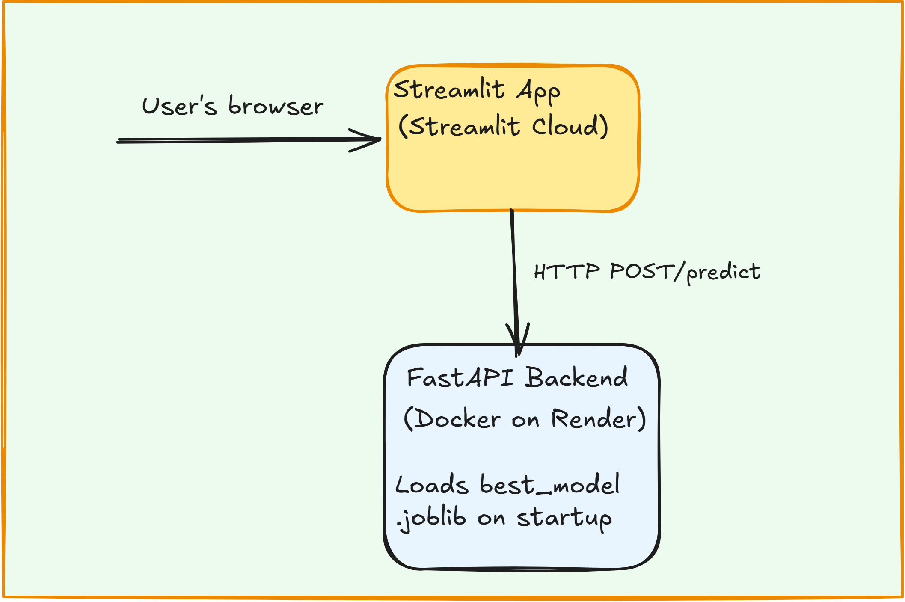

# 🏠Immo Eliza — Real Estate Price Predictor

A machine learning web application that predicts Belgian real estate prices, built as part of the BeCode AI & Data Science training. This project deploys a trained XGBoost regression model through a FastAPI backend and a Streamlit frontend, following **Option 3** of the assignment architecture — API and web app combined, intertwined but deployed separately.

**Live app:** https://nk-immo-eliza-price-predictor.streamlit.app

**Live API:** https://immo-eliza-api-ocrq.onrender.com

**API docs (Swagger UI):** https://immo-eliza-api-ocrq.onrender.com/docs

> Note: the API runs on Render's free tier, which sleeps after inactivity. The first request after a period of inactivity may take up to a minute while the server wakes up.

---

## 📖 Overview

Immo Eliza wanted a way for their web developers to access price predictions programmatically, and a simple interface for non-technical staff and clients to use directly. This project delivers both:

- A **FastAPI backend** that serves predictions from a trained model
- A **Streamlit frontend** that collects property details from a user and displays the predicted price

The two are separate services that communicate over HTTP — the Streamlit app never loads the model directly, it calls the live API, the same way any other client could.

---

## 🧱 Architecture

  

---

## 🗂️ Repository structure

```
immo-eliza-deployment/
├── api/
│   ├── app.py              # FastAPI app: GET / and POST /predict endpoints
│   └── predict.py          # predict() + preprocessing logic, loads the model
├── models/
│   └── best_model.joblib   # Trained XGBoost pipeline (preprocessing + model)
├── streamlit/
│   ├── assets/             # Images used in the app
│   ├── app_stream.py       # Streamlit frontend
│   └── requirements.txt    # Streamlit-specific dependencies
├── Dockerfile              # Builds the API service for Render
├── requirements.txt        # API dependencies
└── README.md
```

---

## 📈 The Model

- **Algorithm:** XGBoost Regressor, selected after comparing against Linear Regression and Random Forest
- **Features:** 19 base features (bedrooms, living area, province, EPC score, state of building, kitchen condition, and more), expanding after one-hot encoding of categorical variables

---

## 🔌 API

### `GET /`

Health check. Returns:

```json
"alive"
```

### `POST /predict`

Accepts property details as JSON and returns a predicted price.

**Example request:**

```json
{
  "data": {
    "bedrooms": 3,
    "living_area_m2": 150,
    "property_type": "House",
    "province": "Brussels Capital Region",
    "bathrooms": 1,
    "facades": 2,
    "has_garage": 1,
    "parking_count": 1,
    "has_garden": 0,
    "garden_area_m2": null,
    "state_of_the_building": "New",
    "epc_score": "C",
    "has_elevator": 0,
    "kitchen_equipped": "Fully equipped",
    "building_year": 2024,
    "is_nearby_city_prestigious": 0,
    "latitude": 50.85,
    "longitude": 4.35
  }
}
```

**Example response:**

```json
{
  "prediction": 349500.0,
  "status_code": 200
}
```

Required fields: `bedrooms`, `living_area_m2`, `property_type`, `province`. All other fields are optional and are imputed by the model's preprocessing pipeline if omitted.

Interactive documentation with a "try it out" option is available at `/docs` on the live API.

---

## 🛠️ Running locally

### API

```bash
cd api
pip install -r ../requirements.txt
uvicorn app:app --reload
```

The API will be available at `http://localhost:8000`.

### Streamlit app

```bash
cd streamlit
pip install -r requirements.txt
streamlit run app_stream.py
```

By default this connects to the live Render API. To point it at a local API instance instead, update `API_URL` in `app_stream.py`.

### Docker (API only)

```bash
docker build -t immo-eliza-api .
docker run -p 8000:8000 immo-eliza-api
```

---

## 🚀 Deployment

- **API:** containerized with Docker and deployed on [Render](https://render.com), auto-deploying from the `main` branch on every push
- **Streamlit app:** deployed on [Streamlit Community Cloud](https://share.streamlit.io), auto-deploying from the `main` branch on every push, using `streamlit/app_stream.py` as the entrypoint

---

## 🎯 Learning objectives

- [X] Deploy a machine learning model through an API endpoint using FastAPI
- [X] Deploy the API to Render using Docker
- [X] Build and deploy a Streamlit web application

---

## Author

Neha — AI & Data Science trainee at BeCode, Brussels

Github profile : [Neha-2204](https://github.com/Neha-2204)

## Project Timeline

Duration : 5 days
06/07/2026 - 10/07/2026
